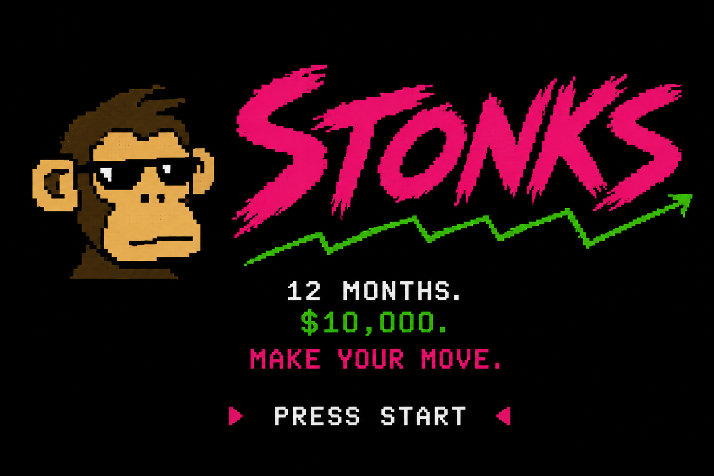

# 🚀 STONKS

A LÖVE 2D trading game — start with $10,000, trade stocks across a simulated week. Balatro-style velvet background, real-time charts, TEMA/EMA indicators, and meme milestones.

<p align="center">
  
</p>

## 🎮 Gameplay

- **$10,000** starting balance
- Trade across **5 trading days** (Monday–Friday)
- **Multiple instruments**: Bitcoin-linked (BITU/SBIT), miners (DUST/GDX/NUGT), gold (GLD), oil (SCO/UCO), S&P 500 (SPXL/SPXS), and EASY mode
- **Order types**: Buy, Sell, Buy Stop, Sell Stop, Stop Loss (unlock as your balance grows)
- **Random events** and a **presidential pick** add chaos
- **Meme milestones** pop up as your balance hits thresholds
- **High scores** persist across sessions

## 📐 Resolution & Scaling

**1080p internal resolution (1920×1080, 16:9)** — like Balatro, the game renders at a fixed resolution and scales uniformly to fit any screen.

| Screen | Behavior |
|--------|----------|
| **Mac/PC** | Window defaults to 1920×1080, resizable |
| **iPhone** | Scaled to fill height, velvet background fills side bars + Dynamic Island |
| **TV (4K)** | Perfect 2× integer scale at 3840×2160 |
| **Any display** | Uniform scale, centered, background bleeds to edges |

All pixel values are designed for a 1280×720 reference and scaled 1.5× to **1920×1080** via `sx()`/`sy()` helpers. Change `BASE_W/BASE_H` to switch the reference resolution. The playable area is **1920×1080**.

## 🏗 Architecture

```
main.lua          — Entry point, screen routing, LOVE callbacks
constants.lua     — BASE_W/H, sx()/sy(), layout constants, trading values
config.lua        — Instruments, groups, presidents, events, milestones
chart.lua         — Chart rendering, SMA/EMA/TEMA, safe area, grid
ui.lua            — All screen UIs, button system, settings, GIMMICKS screen
game.lua          — Trading logic, tick(), positions, feature unlocking, rhythm taps
data.lua          — CSV data loading, instrumentConfig
audio.lua         — Sound effects
haptics.lua       — Haptic feedback module (wraps love.system.vibrate)
conf.lua          — LÖVE window configuration
controls/
  background.lua  — Velvet animated background (Balatro-style)
  button.lua      — Button registry + hit testing (floating-point-safe)
  slider.lua      — Speed slider control
  theme.lua       — Color themes
  init.lua        — Controls module loader
haptics/
  haptics.mm      — iOS UIImpactFeedbackGenerator native code
  System.h/.cpp   — love-source patches adding vibrate() to System class
  patch_pbxproj.py— Auto-adds haptics.mm to Xcode Sources build phase
```

### Screen Flow

```
CANVAS → INITIALS → PRESIDENT → SELECTOR → PINS / TRADING → EOD → RECAP
                                                ↕
                                         HIGHSCORE, HIGHSCORELIST,
                                         INSTRUCTIONS, SETTINGS, GIMMICKS
```

### Key Changes (Recent Session)

| Change | Details |
|--------|---------|
| **Buttons fire on press** | `love.mousepressed`/`touchpressed` call `btn.onClick()` immediately; release skips redundant handlers via `handledOnPress` flag |
| **Floating-point hit fix** | `Button.hit()` snaps coords via `math.floor(mx + 0.5)` — no more off-by-one on resized Mac windows |
| **Settings BACK button** | Returns to trading screen; falls back to TRADING if prices exist; enlarged to `sx(160)×sy(52)` |
| **Rewind acceleration** | Linear ramp `math.min(10, 1 + holdTime)` — +1× per second, cap at 10× |
| **Rhythm tap tendies** | `rewardRhythmTap()` measures interval between trade taps. Matching the BPM (~0.48s at 125 BPM) awards **1 tendie** + heart animation (20% screen height, fades 0.5s) |
| **GIMMICKS screen** | Debug-only screen (in Settings when `unlockAll=true`) toggles snow/ball/skier features |
| **QUIT button** | Goes to SELECTOR screen with full state reset |
| **Tendies vanish instantly** | No more shrink animation on tendie spend |
| **iOS haptics** | Subtle `UIImpactFeedbackGenerator` tap on every buy/sell via `love.system.vibrate(0.02)` |

## 📱 Fresh Clone Workflow

This repo uses LÖVE 11.5's iOS source (gitignored under `ios/`). On a fresh clone:

```bash
# 1. Download LÖVE 11.5 source
# Place it at ios/love-source/ so the structure matches:
#   ios/love-source/platform/xcode/love.xcodeproj
# (The LÖVE source is too large to bundle in this repo)

# 2. Build & deploy to iPhone
make ios-device
```

The `make ios-device` command automatically:
1. **Copies** tracked haptics patches from `haptics/` into `ios/love-source/`
2. **Patches** the Xcode project (`pbxproj`) to compile `haptics.mm`
3. **Builds** the `.app` with real iOS haptic feedback

### Haptics — What's Tracked

When buy/sell is tapped, a subtle `UIImpactFeedbackGenerator` (light) fires via `love.system.vibrate(0.02)`. The following files in the repo make it work — none are gitignored:

| File | Role |
|------|------|
| `haptics/haptics.mm` | iOS native code — uses `UIImpactFeedbackGenerator` for subtle taps |
| `haptics/System.h` | Patched LÖVE header — declares `vibrate()` on the System class |
| `haptics/System.cpp` | Patched LÖVE implementation — wires `System::vibrate()` → haptics module |
| `haptics/patch_pbxproj.py` | Script — adds `haptics.mm` to Xcode's Sources build phase |
| `haptics.lua` | Lua module wrapping `love.system.vibrate()` — `Haptics.tap()` called from `game.lua` |
| `Makefile` | `ios-device` & `ios` targets auto-apply all patches before building |

On a fresh clone, `make ios-device` applies all the native patches automatically — you just need the LÖVE 11.5 source in `ios/love-source/`.

Each screen has a `drawXxx(w, h)` function and a `handleXxxClick(mx, my)` handler. Screens clear the global `Buttons` table on entry to prevent stale button hits.

### Chart Indicators

| Indicator | Type | Period | Color |
|-----------|------|--------|-------|
| Fast MA | **TEMA** (Triple EMA) | 180 ticks (~15 min) | Purple |
| Medium MA | **EMA** | 180 ticks (~15 min) | Gold |
| Price line | Raw price | — | Light gray |

Grid labels toggle between `+1.23%` and `32.40` via the **Settings** screen.

## 🛠 Build & Run

### Prerequisites

- [LÖVE 11.5](https://love2d.org/) (`brew install love`)
- Xcode 26.5+ (for iOS)

### Desktop

```bash
make love      # Package STONKS.love
make run       # Build + launch in LÖVE
make clean     # Remove build artifacts
```

### iOS

```bash
make ios-setup # Clone LÖVE 11.5 + download iOS libraries (first time)
make ios       # Build .love, build iOS app, install on simulator, launch
```

The iOS app is branded as **STONKS** (bundle ID `com.aia.stonks`), landscape-only, with a full-screen velvet background extending under the Dynamic Island.

## 📁 Data Format

CSV files in `data/` with columns: `time, bid, ask`. Files are named by date (e.g., `2026-01-02.csv`). The game can also run in random-walk mode.

## ⚙️ Configuration

All game tuning is in `config.lua`:

- **Instruments**: trading parameters, group assignments, price ranges
- **Features**: unlock thresholds (e.g., `stopLossButton = 100` unlocks at $100 profit)
- **Events**: random news headlines
- **Presidents**: character selection with portraits
- **Milestones**: meme popups at profit thresholds

Config is accessed via the global `instrumentConfig` (not `config`).

## 🎨 Design Notes

- **Pixel filter**: `"nearest"` for crisp scaling
- **Fonts**: `default.ttf`, `RobotoMono-VariableFont_wght.ttf`, `Inter-Regular.ttf`, `pixel.ttf`
- **All sizes use `sx()`/`sy()`**: font sizes, line widths, button dimensions, spacing — everything scales from `BASE_W/BASE_H`
- **Line widths**: `math.max(1, sy(v))` ensures minimum 1px
- **EMA arrays**: use `result[i] = value` (index assignment), never `table.insert(nil)` — Lua's `#` on sparse tables is undefined
- **Scissor**: chart scissor coords multiply by `safeScale` since scissor uses screen space, not the scaled coordinate system

## 📱 iOS Technical Notes

- LÖVE 11.5 source + prebuilt xcframeworks (SDL2, freetype, Lua, ogg, vorbis, theora, modplug)
- Deployment target: iOS 26.4
- Tested on iPhone 17 simulator (iOS 27.0)
- `UILaunchScreen` in Info.plist for native full-screen (no compatibility letterboxing)
- Build bypasses asset catalog (`ASSETCATALOG_COMPILER_APPICON_NAME=""`)
